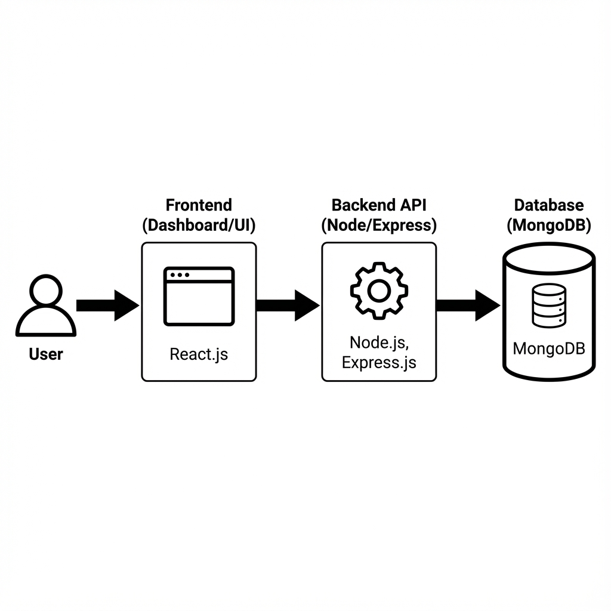

# Software Design Document (SDD)

## 1. Introduction

### 1.1 Purpose of the SDD
The purpose of this document is to outline the design for **Starshield Security**. This will include a view of the architecture of the system, as well as the detail of the programming environment. Additionally, there is a brief section about the user interface of our system.

### 1.2 Software Description
**Starshield Security** is a web-based **Website Protection Directory**. Its primary function is to identify, track, and manage websites that lack Two-Factor Authentication (2FA), providing a centralized platform for users to monitor security risks.

The system allows users to:
*   **Register and Login** securely using JWT authentication.
*   **Track Websites**: Maintain a directory of vulnerable websites.
*   **Assess Risk**: Assign risk levels (High, Medium, Low) to each site.
*   **Manage Protection**: Update the status of websites as they adopt 2FA solutions.

## 2. Programming Environment
The application is built using a modern **MERN-compatible stack** (currently Backend-focused for the First Release).

*   **Operating System**: Windows / macOS / Linux
*   **Runtime Environment**: Node.js (v18+)
*   **Framework**: Express.js (Web Framework for Node.js)
*   **Database**: MongoDB (NoSQL Database) with Mongoose ODM
*   **Authentication**: JSON Web Tokens (JWT) & BcryptJS
*   **Tools & IDE**: Visual Studio Code, Git, Postman (for API testing)

## 3. Software Architecture
The system follows the **Model-View-Controller (MVC)** architectural pattern to ensure separation of concerns and scalability.

### 3.1 System Architecture Diagram
The following diagram illustrates the high-level architecture of the Starshield Security application, showing the data flow from the User to the Database.

#### **Component Descriptions**
1.  **User**: The end-user interacting with the system via a web browser.
2.  **Frontend (UI)**: The client-side interface (Dashboard, Forms) that sends requests to the API.
3.  **Backend API (Express)**: The server-side logic that processes requests, handles authentication, and manages data.
4.  **Database (MongoDB)**: The persistent storage for User and Website data.

## 4. Prototype (Screen Shots)
*(Paste your screenshots here)*

### 4.1 Server Startup
*(Paste Screenshot of terminal showing "MongoDB Connected...")*

### 4.2 API Verification
*(Paste Screenshot of `node verify_api.js` output)*

### 4.3 Project Structure
*(Paste Screenshot of VS Code file explorer)*

## 5. Database Schema
### Website Schema
| Field | Type | Description |
|-------|------|-------------|
| `name` | String | Name of the website |
| `url` | String | URL of the website |
| `riskLevel` | String | 'Low', 'Medium', 'High' |
| `isProtected` | Boolean | Whether 2FA protection is active |
| `createdBy` | ObjectId | Reference to the User |

### User Schema
| Field | Type | Description |
|-------|------|-------------|
| `username` | String | Unique username |
| `email` | String | Unique email |
| `password` | String | Hashed password |
